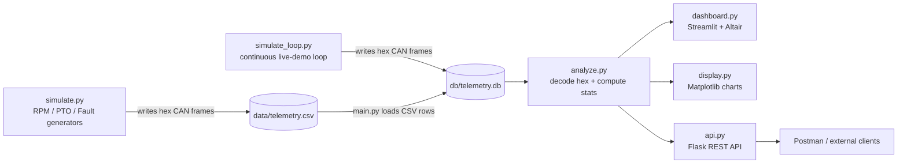
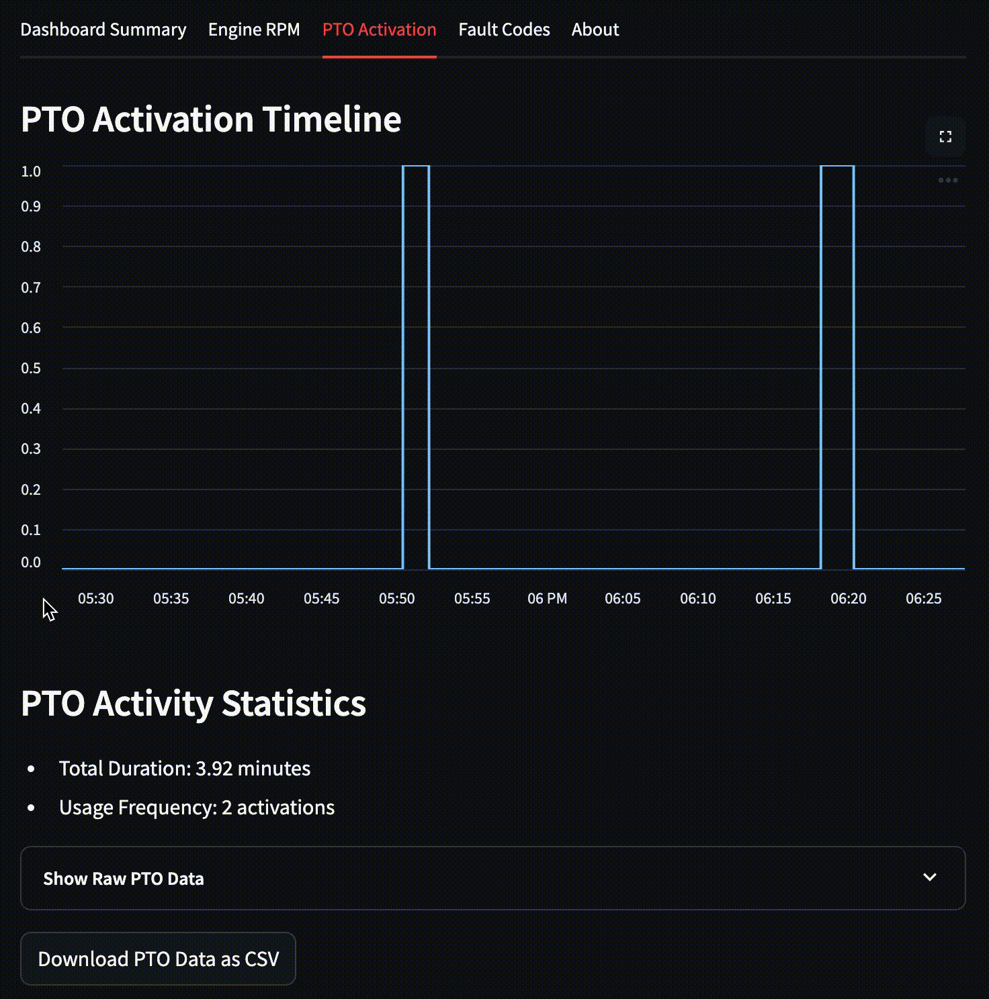
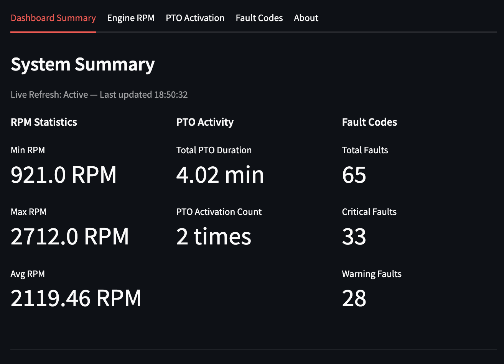
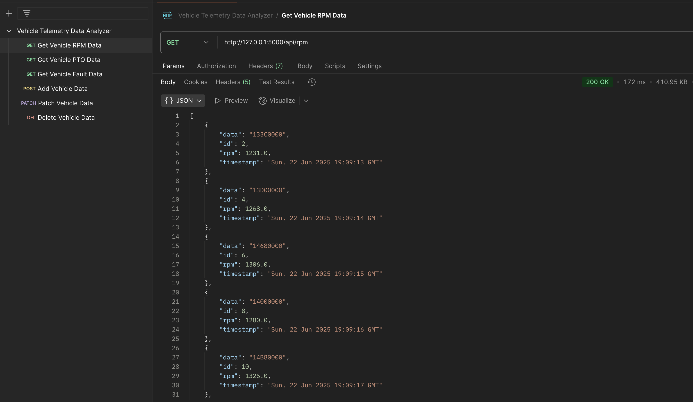
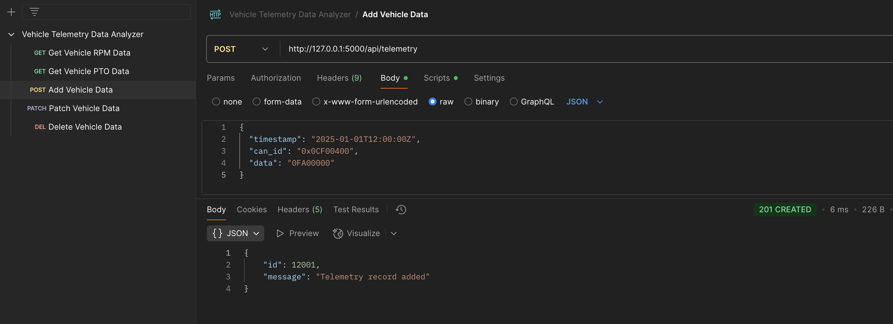

# Vehicle Telemetry Data Analyzer

This project is a Python-based tool for simulating and analyzing vehicle telemetry data, including engine RPM, PTO activity, and fault codes. It generates CAN Bus messages in hexadecimal format according to the SAE J1939 standard and stores them in a SQLite database. The raw hex data is then decoded into human-readable values and displayed on an interactive Streamlit dashboard. The project replicates key functions of commercial fleet diagnostics platforms, using realistic data patterns and message structures. A Postman collection is also provided to perform full CRUD operations on the database, enabling further customization and future extensions of the project.

## Key Features ##
- Simulated CAN/J1939 messages
- SQLite data storage
- Data trend analysis with Pandas
- Data displayed using Streamlit and Matplotlib
- Backend API routes to perform CRUD operations

## How It Works ##

The project is organized as a five-stage pipeline: simulated CAN data is generated, loaded into a database, decoded and analyzed, then presented through a dashboard and an API. Each stage lives in its own module so that the simulation, storage, analysis, and presentation  can be tested and modified independently.


```mermaid
flowchart LR
    A["simulate.py<br/>RPM / PTO / Fault generators"] -->|writes hex CAN frames| B[("data/telemetry.csv")]
    A2["simulate_loop.py<br/>continuous live-demo loop"] -->|writes hex CAN frames| C[("db/telemetry.db")]
    B -->|"main.py loads CSV rows"| C
    C --> D["analyze.py<br/>decode hex + compute stats"]
    D --> E["dashboard.py<br/>Streamlit + Altair"]
    D --> F["display.py<br/>Matplotlib charts"]
    D --> G["api.py<br/>Flask REST API"]
    G --> H["Postman / external clients"]
```

`simulate.py` models three independent aspects of a running vehicle as small state machines: 

- `RPMGenerator` gradually changes engine speed toward randomized targets so it moves smoothly and within a realistic range instead of jumping between values
- `PTOStateMachine` toggles power-take-off on and off using randomized but realistic frequency and duration dwell timers so engagement looks like a real duty cycle rather than noise
- `FaultGenerator` occasionally raises an SPN/FMI fault code for a period of time

Each tick of simulated time is encoded into a hexadecimal CAN payload and written out as a row of `timestamp, can_id, data`. `main.py` loads those rows into a SQLite database, which `analyze.py` then queries and decodes back into RPM values, PTO on/off state, and fault codes with human-readable descriptions and severity levels. `dashboard.py`, `display.py`, and `api.py` all consume `analyze.py`'s functions rather than re-implementing any decoding themselves, so there is a single source of truth for what the raw hex data means.

For a quick live demo, `simulate_loop.py` runs the same three generator classes in a continuous loop against the live database instead of a one-shot CSV batch. The PTO/fault timers are shortened significantly so a demo doesn't have to wait 20-30 minutes for the first PTO/fault event to appear.

## Project Structure ##

| File | Role |
| ---- | ---- |
| `simulate.py` | Generates simulated CAN/J1939 telemetry (RPM, PTO, faults) to a CSV file |
| `simulate_loop.py` | Continuously generates telemetry directly into the database for live demos |
| `main.py` | Loads the simulated CSV data into the SQLite database |
| `analyze.py` | Decodes raw hex data and computes RPM, PTO, and fault statistics |
| `dashboard.py` | Interactive Streamlit dashboard with charts, stats, and CSV export |
| `display.py` | Standalone Matplotlib charts for RPM and PTO over time |
| `api.py` | Flask REST API exposing read/write access to the telemetry database |
| `constants.py` | Shared CAN IDs and file paths to maintain consistency across modules |
| `test_analyze.py` | Pytest suite covering the decoding and statistics functions |
| `data/spn_fmi_decoder.csv` | Lookup table mapping SPN/FMI codes to fault descriptions |

## Design Decisions ##

A few of the design choices are important to explain;

- The RPM field is encoded and decoded using a 0.125 rpm/bit resolution, matching the real SAE J1939 PGN 61444 (Electronic Engine Controller 1) specification, rather than an arbitrary scale factor, so the simulated data behaves the way a real J1939 analyzer's output would. Fault codes follow the same SPN/FMI structure used in real heavy-duty diagnostics: the first four hex characters of a fault payload are the Suspect Parameter Number and the next two are the Failure Mode Identifier, which is then mapped to a severity level.

- Decoding logic is centralized in `analyze.py` and imported everywhere it's needed, instead of being duplicated across the API and dashboard, so a fix or change to how a value is decoded only has to happen in one place. Similarly, CAN IDs and file paths live in `constants.py` rather than being retyped as strings in every file, which removes a class of bug where one file's constant doesn't match another's. `simulate_loop.py` reuses the exact same generator classes as `simulate.py`, with only their timer windows overridden for demo speed, instead of maintaining a second copy of the same simulation logic.

## Testing ##

`test_analyze.py` is a Pytest suite covering the core decoding and statistics functions: hex-to-RPM conversion, PTO on/off decoding, fault code decoding, severity classification, and the PTO usage-counting logic, which distinguishes the number of times PTO was engaged from the total time it was on by detecting off-to-on transitions rather than just counting "on" rows. It also verifies that fault statistics return a consistent set of keys whether or not there's any fault data yet, and that unknown SPN/FMI combinations fall back to a placeholder description instead of failing. Run it with `pytest test_analyze.py -v` after installing `requirements.txt`.

## Project Preview ##

*Dashboard display of engine RPM over time as well as RPM stats.*


<br>
<br>

***
*Dashboard display of fault codes and stats.*


<br>
<br>

***
*Dashboard display of PTO activations and stats.*



<br>
<br>

***
*Dashboard summary of all key metrics of the simulated data.*



<br>
<br>

***
*Sample GET request tested using Postman collection.*



<br>
<br>

***
*Sample POST request tested using Postman collection.*



<br>
<br>

# How to Run the Project:

## 1. Clone the Repo ##
```bash
git clone https://github.com/yourusername/vehicle-telemetry-analyzer.git
cd vehicle-telemetry-analyzer
```

## 2. Create & Activate Virtual Environment ##
```bash
# On Windows (PowerShell): 
python -m venv .venv
.venv\Scripts\activate.ps1

# On macOS / Linux
python3 -m venv venv
source venv/bin/activate 
```

## 3. Simulate, Store, and Display Data ##
```bash
pip install -r requirements.txt # Install required packages

python simulate.py # Generate simulated telemetry data

python main.py # Load data into SQLite database

python display.py # Display engine RPM and PTO activations over time

streamlit run dashboard.py # Run the dashboard

python api.py # Launch API routes and Flask app on http://127.0.0.1:5000
```

## 4. Live Simulated Data Demo ##
```bash
./clear.sh  # Clear existing data
./live_demo.sh  # Run simulation loop data script and dashboard
```

## Limitations & Future Work ##

The simulator currently models a single vehicle rather than a fleet, and the FMI-to-severity mapping is a simplified three-tier version of the more complete classification used in real J1939 diagnostics. The API also has no authentication, which would be necessary before exposing it outside a local demo. Planned extensions include anomaly detection on RPM and fault frequency, and validating the simulator's output against a real-world J1939 log sample rather than only against its own generated data.

## API Endpoints ##

| Method        | Route                | Description              |
| ------------- | -------------------- | ------------------------ |
| GET           | '/api/rpm'           | Get RPM telemetry data   |
| GET           | '/api/pto'           | Get PTO telemetry data   |
| GET           | '/api/faults'        | Get Fault telemetry data |
| POST          | '/api/telemetry'     | Add new telemetry data   |
| PATCH         | '/api/telemetry/:id' | Patch telemetry data     |
| DELETE        | '/api/telemetry/:id' | Delete telemetry data    |