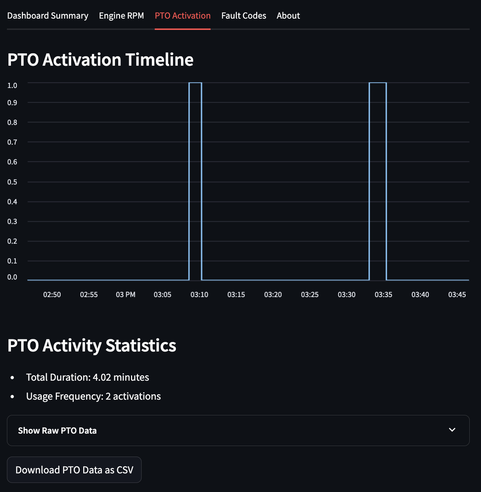
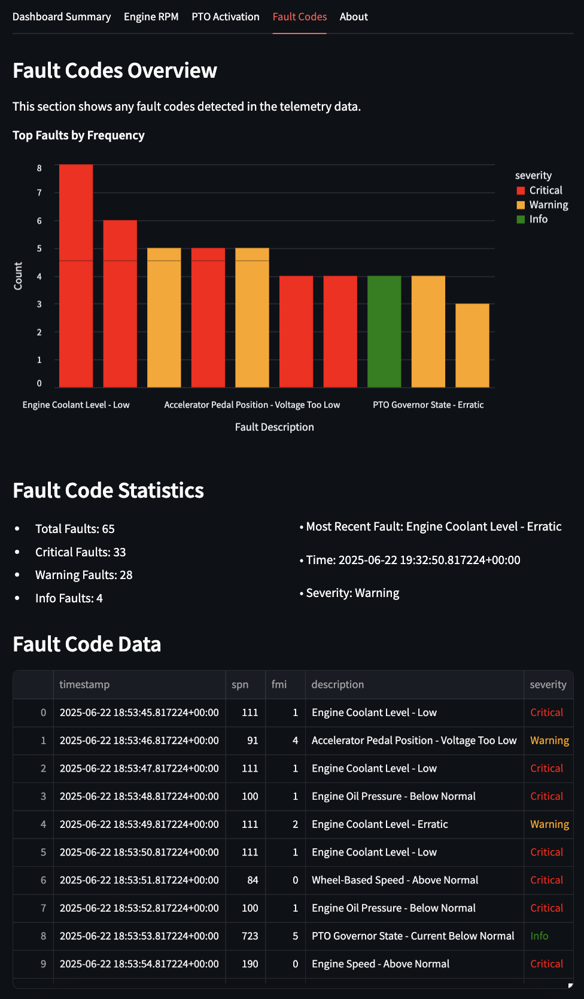
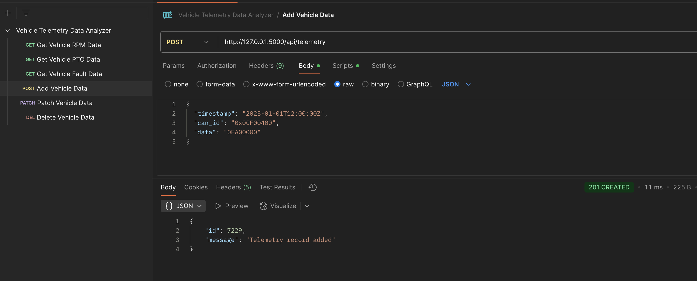

# Vehicle Telemetry Data Analyzer

This project is a Python-based tool for simulating and analyzing vehicle telemetry data, including engine RPM, PTO activity, and fault codes. It generates CAN Bus messages in hexadecimal format according to the SAE J1939 standard and stores them in a SQLite database. The raw hex data is then decoded into human-readable values and displayed on an interactive Streamlit dashboard. The project replicates key functions of commercial fleet diagnostics platforms, using realistic data patterns and message structures. A Postman collection is also provided to perform full CRUD operations on the database, enabling further customization and future extensions of the project.

## Key Features ##
- Simulated CAN/J1939 messages
- SQLite data storage
- Data trend analysis with Pandas
- Data displayed using Streamlit and Matplotlib
- Backend API routes to perform CRUD operations

## Screenshots ##

*Dashboard display of engine RPM over time as well as RPM stats.*


<br>
<br>

*Dashboard display of PTO activations and stats.*



<br>
<br>

*Dashboard display of fault codes and stats.*



<br>
<br>

*Dashboard summary of all key metrics of the simulated data.*


<br>
<br>

*Sample GET request tested using Postman collection.*


<br>
<br>

*Sample POST request tested using Postman collection.*



<br>
<br>

# How to Run the Project:

## 1. Clone the Repo ##
```bash
git clone https://github.com/yourusername/vehicle-telemetry-analyzer.git
cd vehicle-telemetry-analyzer
```

## 2. Create & Activate Virtual Environment ##
```bash
python3 -m venv venv
source venv/bin/activate # On Windows: .\venv\Scripts\activate
```

## 3. Simulate, Store, and Display Data ##
```bash
pip install -r requirements.txt # Install required packages

python simulate.py # Generate Simulated Telemetry Data

python main.py # Load Data into SQLite Database

python display.py # Display Engine RPM and PTO activations Over Time

streamlit run dashboard.py # Run the Dashboard

python api.py # Launch API routes and Flask app on http://127.0.0.1:5000
```


## API Endpoints ##

| Method        | Route                | Description             |
| ------------- | -------------------- | ----------------------- |
| GET           | '/api/rpm'           | Get RPM telemetry data  |
| GET           | '/api/pto'           | Get PTO telemetry data  |
| POST          | '/api/telemetry'     | Add new telemetry data  |
| PATCH         | '/api/telemetry/:id' | Patch telemetry data    |
| DELETE        | '/api/telemetry/:id' | Delete telemetry data   |
